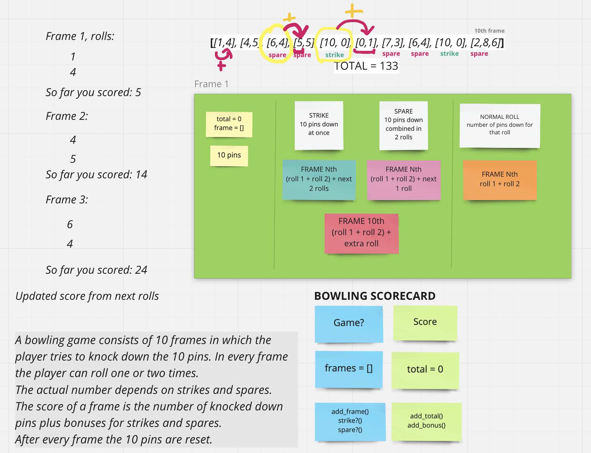

# Bowling Challenge

A bowling game scorecard program.

## Getting Started

### Installation

1. Clone the repo
```
  git clone https://github.com/Riky5/bowling-challenge-ruby.git
```
2. Install the gems
```
  bundle install
```
3. Run test
```
  rspec
```
---
## Usage

In the terminal start irb
```
  irb -r ./lib/game.rb -r ./lib/score.rb
  3.0.0 :001 >
```
Initialise a new game and score for that game.
```
  3.0.0 :001 > riky = Game.new
  => #<Game:0x0000000130971d88 @frames=[]> 
  3.0.0 :002 > my_score = Score.new(riky)
  => #<Score:0x000000013086bec0 @game=#<Game:0x0000000130971d88 @frames=[]>, @total=0> 
  3.0.0 :003 > 
```
Examples:

1. From frame 1 to 9.  
1st roll = I hit 4 pins  
2nd roll = I hit 5 pins  
Not a spare, not a strike.

Add to scorecard and get score
```
  3.0.0 :003 > riky.add_rolls(4,5)
  => [[4, 5]] 
  3.0.0 :005 > my_score.add_to_total
  => 9 
```

---
2. From frame 1 to 9.  
1st roll = I hit 4 pins  
2nd roll = I hit 6 pins  
SPARE! 🥳

Add to scorecard and get score (as a second frame in this example)

```
  3.0.0 :006 > riky.add_rolls(4,6)
  => [[4, 5], [4, 6]] 
  3.0.0 :007 > my_score.add_to_total
  => 19 
```
Like in a real bowling game the current result is 9 from previous frame + 10 from the current spare. The bonus will be added in the next frame.

```
  => [[4, 5], [4, 6], [5, 5]] 
  3.0.0 :008 > score.add_to_total
  => 34 
```
34 = 19 from previous 2 frames + 10 from next frame + 5 spare bonus

---
3. From frame 1 to 9.  
1st roll = I hit 10 pins  
STRIKE ! 🥳

Add to scorecard and get score (as a sixth frame in this example)
```
  3.0.0 :014 > riky.add_rolls(10,0)
  => [[4, 5], [4, 6], [5, 5], [2, 4], [3, 3], [10, 0]]
  3.0.0 :015 > my_score.add_to_total
  => 58 
```
Same as with spare the current result is 58 and the bonus will be added with the next frame.
```
  => [[4, 5], [4, 6], [5, 5], [2, 4], [3, 3], [10, 0], [5, 1]] 
  3.0.0 :016 > score.add_to_total
  => 70 
```
70 = 58 from previous 6 frames + 6 from next frame + 6 strike bonus

---
4. 10th frame.  
1st roll = I hit 3  
2nd roll = I hit 7  
SPARE  
Bonus roll = I hit 5
```
  3.0.0 :021 > riky.add_rolls(3,7,5)
  => [[4, 5], [4, 6], [5, 5], [2, 4], [3, 3], [10, 0], [5, 1], [7, 3], [1, 1], [3, 7, 5]] 
  3.0.0 :022 > score.add_to_total
  => 98 
```
Game ends with 98 points

Try it out! 🙃

---
My diagramming and planning..

