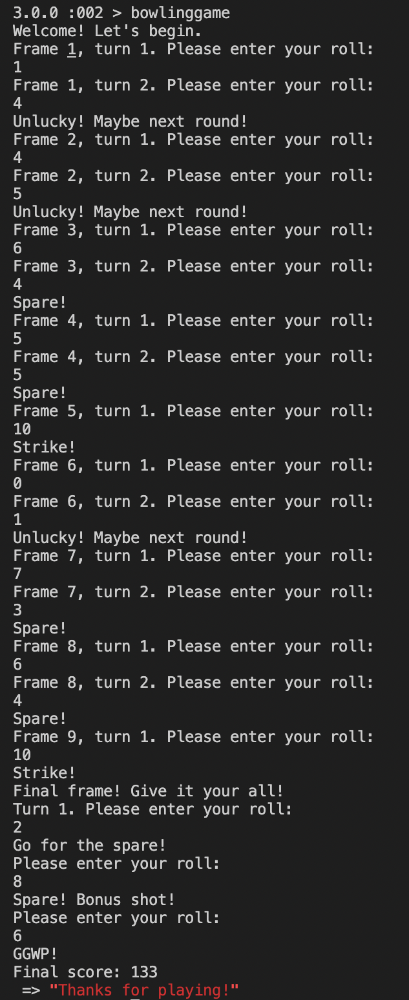

Anthony's Bowling Challenge
=================
[Readme adapted from here](https://github.com/makersacademy/bowling-challenge-ruby)

## Introduction

My attempt at the week 5 Bowling challenge in Ruby. 

## Setting up

Please run 
* `bundle install`

For testing suite:
* `rspec`

For code quality:
* `rubocop`

To run the mini-interface, in the command line, do:
* `irb`
* `require './bowling_game.rb'`
* `bowlinggame`
* Follow the promts to input your scores.
* A score will be shown at the end of your game.

## Breakdown of this challenge

I initially determined that I would need three classes - a bowling game model, a turn calculator and a score calculator. I soon started to get lost, however, in the interactions between the classes, especially when it came to dealing with frame 10. Especially since the score being calculated was dependent on the turn, I decided that the two classes would have overlapping methods; they then became one class.

The bowling_game.rb file is not necessary for the game to be played - it is simply a model file to give it a nicer interface. As such, I have not added the file to the testing suite, as I intend to replace it with a Javascript front end in the following weeks. You can run the Bowling class, execute `.roll(number)` for each of your bowling rolls, then run `.score` at the end to get an overall score.

Given more time, I would like to refactor the bowling class to see if I can extract a score class from the Bowling class. I beleive it would give me more power to calculate scores for previous rolls and update a score card in real-time. However, I believe this would still be possible with how I've laid out the challenge.

Code Review
-----------

In code review we'll be hoping to see:

* All tests passing - 9 examples, 0 failures
* High [TEST COVERAGE: 100.00% -- 115/115 lines in 2 files](https://github.com/makersacademy/course/blob/main/pills/test_coverage.md)

Examples
-----------

More about ten pin bowling here: http://en.wikipedia.org/wiki/Ten-pin_bowling

  
Example of the above:  

