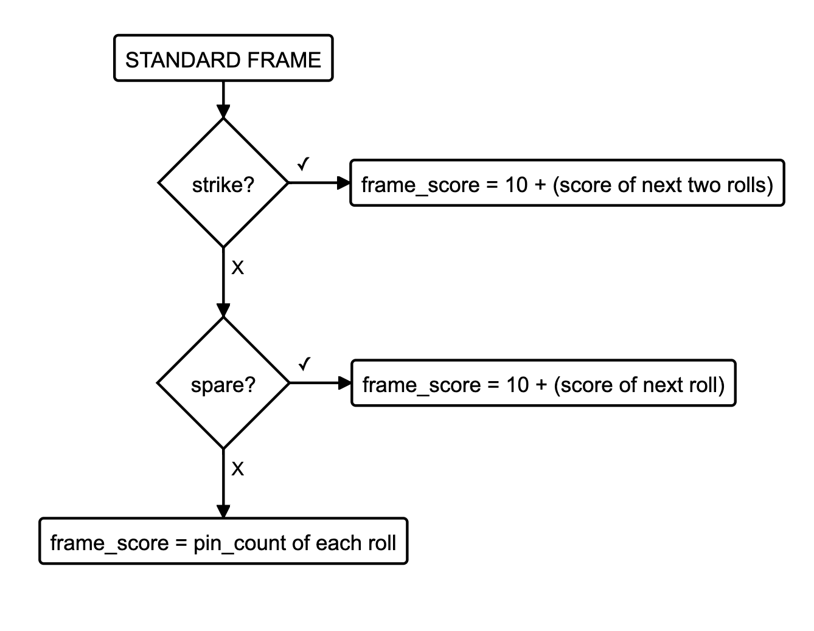

Bowling Challenge in Ruby
=================

This is a partial solution as I didn't have time in the weekend to focus on the challenge.

Apart from Makers' readme, I used different resource to get familiar with the bowling scoring system and its logic:
* [How to Keep Score in Bowling](https://www.youtube.com/watch?v=-4wNjb9F1mo)
* [The Rules of Ten Pin (10 Pin) Bowling - EXPLAINED!](https://www.youtube.com/watch?v=E2d8PizMe-8)
* [Scoring Bowling](https://www.youtube.com/watch?v=aBe71sD8o8c)

I created a diagram of an open spare:

And read [TheBowlingGameKata](http://www.butunclebob.com/ArticleS.UncleBob.TheBowlingGameKata).

I started translating this into code while watching:
* [Bowling Game Kata -- Ruby](https://www.youtube.com/watch?v=EyMwodeq1h4) by Adam Coder
* [Bowling Game - Ruby](https://www.youtube.com/watch?v=wrr16PdgHPM) by Peter Sullivan
But they both had an interpretation of the Spare score that I had doubts about, so I didn't go any further.

I then ran out of time and decided to submit this draft.
