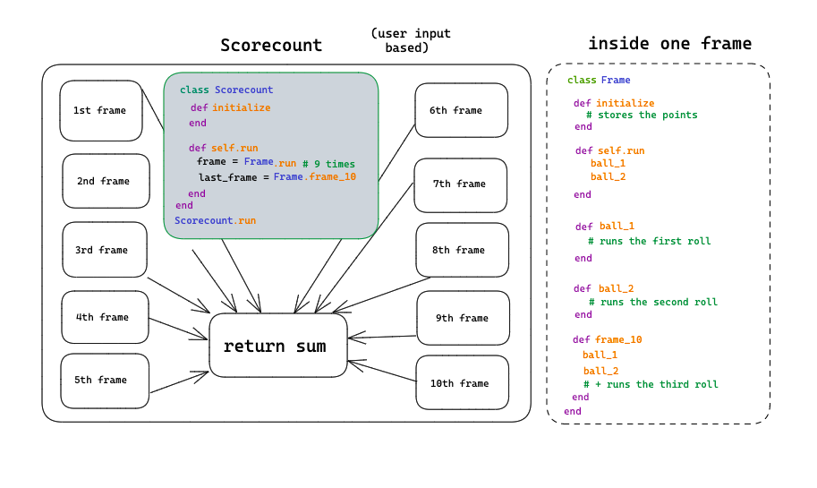

Game Scorecount
===============

# Content

- **class Frame**

It generates the score for the one of the frames based on user input for each roll.

- **class Scorecount**

It runs each frame of a game and returns the sum of their scores.

