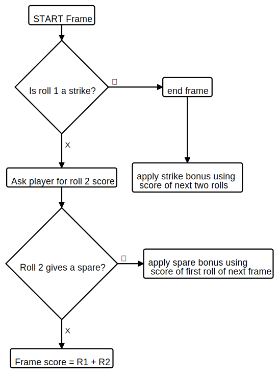

Beca Parker's solution to Bowling Scorecard Challenge (Ruby)  
============================================================

## What the code does

This ruby code provides the logic for counting and summing the scores of a 10-pin bowling game for one player, according to the [traditional scoring rules](https://en.wikipedia.org/wiki/Ten-pin_bowling#Traditional_scoring).

*Input:* User inputs the number of pins knocked down at each roll.  
*Output:* The methods can return the current frame and roll, an array of current frame scores, and the current total score depending on what commands the eventual UI calls on throughout.


## Setup

Use these commands in your terminal:  
* `git clone https://github.com/BecaLParker/chitter-challenge`  
* `cd chitter-challenge`  
* `bundle`  
* now you can run the tests I built: `rspec`
* and/or interact as a user in irb: 
  > `irb -r './lib/scorecard.rb`   
  > `s=Scorecard.new`  
* See user stories below for further commands


## My goals during this challenge

The user interface in this solution is intentionally minimal.
Instead, the focus for this challenge was to write high-quality code.

In order to do this, I aimed to give particular attention to :
* Using diagramming to plan my approach to the challenge
* TDD the code
* Focus on testing behaviour rather than state
* Commit often, with good commit messages
* Single Responsibility Principle and encapsulation (WIP -  I plan to extract a frame class that will inject instances of frames into an array in the scorecard class)
* Clear and readable code (WIP - I plan to refactor further)

## Planning and approach

I created [user stories](./planning/user_stories.md), which in turn helped me establish some models (see [planning folder](./planning)) e.g.: 


## User stories and commands
#### Normal frames (where player scores less than 10 in a frame)
For this user story:
> So that I don’t get access to more than 10 pins per frame,  
> I want to know if I’ve tried to enter more than 10 in total across the rolls of a frame (in frames 1-9). 

In irb, enter a pin score greater than 10 for either a roll or a frame:   
`s.roll_1(11)`,   
or `s.roll_1(1)` followed by `s.roll_2(10)`.  
You should get an output like: `RuntimeError (Max pins exceeded, recheck and try again)`  

____

> So that I can have more than one go at knocking down the pins in a frame,  
> I want the scoreboard to accumulate my score from two rolls per frame (and potentially 3 rolls in frame 10 - see special frames). 

In irb, call the frame_scores method at any point during the game: `s.frame_scores`  
You should get an array of 10 numbers. The numbers represent the current score for frames 1-10). At the start of a new game, all 10 numbers will be 0. Observe the change after you've entered some roll inputs: `s.roll_1(1)`, `s.roll_2(1)`

____

> So that I can play a 10-frame game,  
> I want to know my final total score after 10 frames.  

In irb, enter 10 frames of a new game: 
```
  s=Scorecard.new  
  10.times { s.roll_1(1)
   s.roll_2(1) }
```  

```
  s.frame_scores
    => [2, 2, 2, 2, 2, 2, 2, 2, 2, 2] 
  s.final_score
    => 20 
```

Notice that calling `s.final_score` before having entered all 10 frames, will receive an error output like: `RuntimeError (You have not bowled 10 frames yet)`  

#### Special frames (where player scores 10 in a frame)  

##### Spare  
> When I knock down 10 pins with the two rolls of a frame,   
> I want the the ‘spare bonus’ rules to apply to the next roll (first roll of the next frame). 
In irb, enter a spare in the first frame of a new game: 
```
s=Scorecard.new 
s.roll_1(5)
s.roll_2(5)
```
Notice that `s.frames_scores` is showing normal scoring so far...
Now knock down 2 pins in your next throw: `s.roll_1(2)` and run `s.frames_scores` again to see the score for frame 1 updated to 12.   
Finish frame 2 with `s.roll_2(2)`.  
Your  `s.frames_scores` output will now be `[12, 4, 0, 0, 0, 0, 0, 0, 0, 0]` 

___

##### Strikes  
> When I knock down 10 pins in the first roll of a frame,  
> I want the frame to end.  

In irb, enter a strike on roll one of a new game: 
```
s=Scorecard.new 
s.roll_1(10)
s.current_frame
```
You will get a return of '2' because the game has auto-advanced to the second frame.

___

> When I knock down 10 pins in the first roll of a frame,  
> I want the ‘strike bonus’ rules to apply to the next two rolls (which could be one frame, > or if I get another strike - could be more than one frame)  

In irb, enter a strike on roll one of a new game, then enter some non-special rolls for the next frame: 
```
s=Scorecard.new 
s.roll_1(10)
s.roll_1(4)
s.roll_2(3)
```
Your  `s.frames_scores` output will now be `[17, 7, 0, 0, 0, 0, 0, 0, 0, 0]` 

To see strike chaining in action:
```
s=Scorecard.new 
s.roll_1(10)
s.roll_1(10)
s.roll_1(2)
s.roll_2(3)
```
Your  `s.frames_scores` output will now be `[22, 15, 5, 0, 0, 0, 0, 0, 0, 0]` 

___

##### Strike/Spare in 10th frame  
>When I roll a strike or spare in the 10th frame,  
>So that the corresponding bonus rules (strike or spare) can apply,  
>I want to be able to enter my score for up to 3 rolls.  

In irb, enter 9 frames of a new game, then score a strike or a spare in frame 10: 
```
  s=Scorecard.new  
  9.times { s.roll_1(1)
   s.roll_2(1) }
  s.roll_1(10)
  s.roll_2(4)

```  
You will now be able to run `s.roll_3(4)`. Note that running roll_3 without having first scored a strike or spare in frame 10 will throw an error like: 'You are not eligible for roll_3'  

___

>So that I can score the perfect 10th frame,  
>I want to be able to enter a max of 10 per roll in the 10th frame. 

In irb, enter 9 frames of a new game, then a perfect 10th frame:
```
  s=Scorecard.new  
  9.times { s.roll_1(1)
   s.roll_2(1) }
  s.roll_1(10)
  s.roll_2(10)
  s.roll_3(10)

```  

Your `s.roll_scores` output will show two rolls entered for frames 1-9 and the 3 tens in the final array item. 

___

>So that any additional rolls in frame 10 only count for the bonus (not for the regular frame count),  
>I want the scoreboard to know if the roll I’m entering a score for is ‘regular’ vs ‘bonus’. 

You can test this in irb by bowling the perfect game (final score 300) or by entering the scores as per the [example score card](./images/example_ten_pin_scoring.png) Makers provided. 

