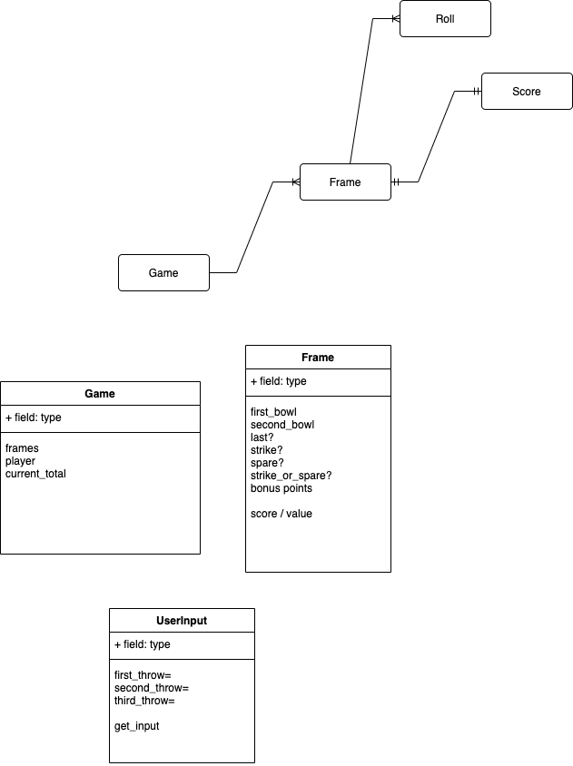

## Bernard's Bowling Challenge

# Preparations

I started this by spending a good amount of time writing out bowling score boards until I understood exactly how the scoring works, how every spare gets it's bonus from what ever the value of the next roll. The next thing I got my head around was how strikes and compund strikes worked. This confused me at first until I realised that a frames strike bonus is always the face value of the next two rolls, even if this goes across two more frames, so three strikes in a row means the first strike gets thirty because the face value of the next two rolls are ten even though it's two frames ahead by now. 

# Diagramming

I did a domain model thinking to have a game and a frame and a user input.

I perhaps could have spent longer thnking this through.

# Starting Coding

Did my best here to really try and foucs on process. Built up the game and frame where a game has ten frames which have their own frame number. This is stored as an instance variable on the game class. I put the logic of recording rolls on the frame where I expected it to know what a spare and strike was and put 'X' or '/'.

Then I thought of having a current frame in the game and an ability to navigate foward and backwards between frames.

Following this an ability to flatten all the scores within the Frames into one array in an all rolls as a way to try and calculate bonus points. At this point I had limited time to continue. 