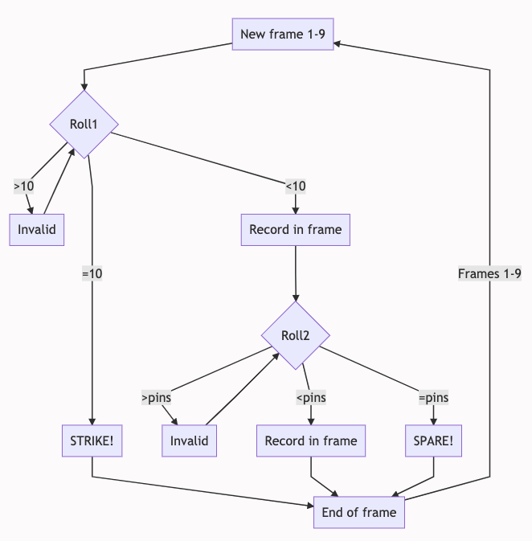
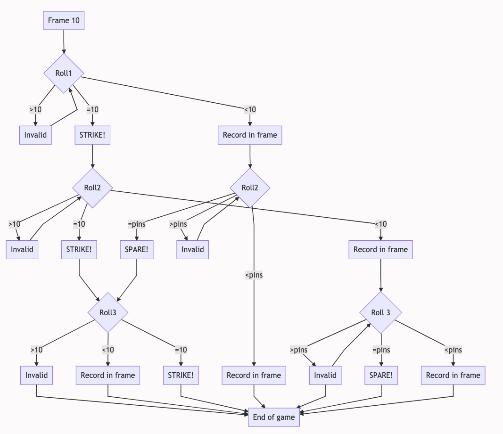

# Bowling Challenge in Ruby

## The Task

**THIS IS NOT A BOWLING GAME, IT IS A BOWLING SCORECARD PROGRAM. THE USER INPUTS THE ROLLS.**

Count and sum the scores of a bowling game for one player. For this challenge, you do _not_ need to build a web app with a UI, instead, just focus on the logic for bowling (you also don't need a database).

A bowling game consists of 10 frames in which the player tries to knock down the 10 pins. In every frame the player can roll one or two times, apart from in frame 10 when they can have up to 3 rolls. The actual number depends on strikes and spares. The score of a frame is the number of knocked down pins plus bonuses for strikes and spares. After every frame the 10 pins are reset.

[Bowling Rules](bowling_rules.md)

## Planning the Task

I decided to use a flow chart to map the process of play for a bowling game.  The first 9 frames run through the same process of one or two rolls, depending on score.  Here is the flow chart for the first 9 frames:

The scoring for the last frame operates slightly differently, with a bonus roll being available if a player gets a strike or a spare in either of the two original rolls for the frame.  This complicates the flow chart as shown below:

## Improvements required
My current score method does not currently correctly calculate the score in the event that the player makes consecutive strikes. All other score combinations are calculated correctly.
