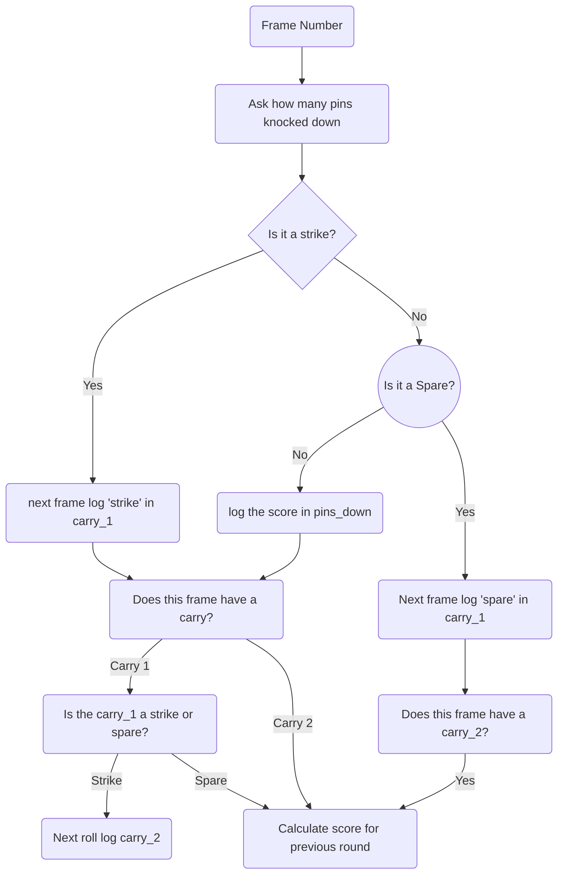

Bowling Challenge in Ruby
=================

This is the week 5 weekend challenge for Makers Academy Bootcamp.  

For this challenge we have been asked to make a scoring programme for ten pin bowling. 

Planning
=======

Still need to think about Does this frame have a carry --> no
Next frame
Next roll
Frame 10

But it is getting there I think 