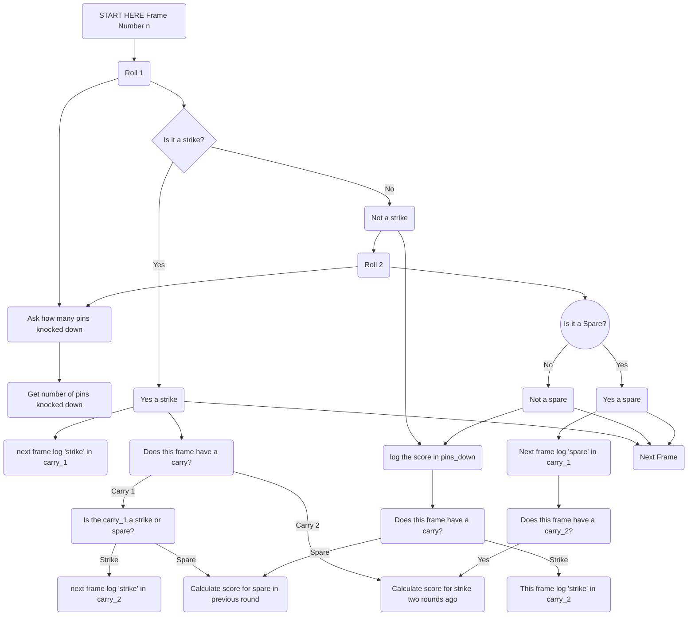

Bowling Challenge in Ruby
=================

This is the week 5 weekend challenge for Makers Academy Bootcamp.  

For this challenge we have been asked to make a scoring programme for ten pin bowling. 

Planning
=======

Still need to think about Does this frame have a carry --> no
Next frame
Next roll
Frame 10

But it is getting there I think 

I'm a bit confused as to the carry 1's and carry 2's - are they fit for purpose? Or do we need 'internal' 1 and 2 and 'external' 1 and 2 - so one is about carrying a strike from roll 1 to roll 2 and the other is about carrying a striker from frame x to frame y to frame z?