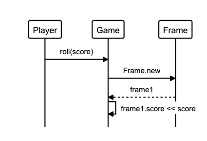

Bowling Challenge in Ruby
==========================

[](https://travis-ci.com/AJ8GH/bowling-challenge-ruby) [](https://coveralls.io/github/AJ8GH/bowling-challenge-ruby?branch=main) [](https://github.com/rubocop/rubocop) [](https://codeclimate.com/github/AJ8GH/bowling-challenge-ruby/maintainability)

Bowling score tracker written in Ruby.

## Technologies used

OOP & OOD:
- SRP
- Encapsulation
- Dependency Injection
- Open-Closed Principle

## Dependencies

Ruby version:
- `2.7.2`

Gems
- `coveralls`
- `rspec`
- `rubocop`

## Getting started

Clone this repositiory and install the dependencies

```shell
git clone git@github.com:AJ8GH/bowling-challenge-ruby.git
cd bowling-challenge-ruby
bundle
```

--------

## Approch and design
-

## Reflections
-

---------

## User stories

```
As a bowler,
So that I can track my score while I play,
I want to be able to record a score from 1 roll.

As a bowler,
So that I can accurately assess my game,
I want to be able to record the score of individual roles,

As a bowler,
So that I can track my total score across multiple rolls and frames,
I want my score to accumlate as I play.

Specs:
- 10 frames
- spare bonuses
- strike bonuses
- final frame bonus rolls
```

## Models

### Class models

objects | Messages
--------|----------
Game    | game.roll
Game    | game.score -> sum of 2 rolls or 1 roll if strike
Game    | game.over
Game    | game.final_frame?
Game    | game.bonus
Frame   | frame.over?
Frame   | frame.status -> :strike, :spare
Frame   | frame.score -> sum of 2 rolls or 1 roll if strike

### sequence diagrams

Adding score from 1 roll:



----

## Rules

### basic functionality
- 1 player
- 10 frames
- rolls per regular frame:
  - 1 if strike
  - 2 if *no* strike
- rolls per final frame:
  - 2 if *no* spare or strike
  - 3 if spare or strike
- score = number of pins *(+ strike / spare bonus)*

### bonuses
- ***strike bonus:***
  - number of pins knocked down in next 2 rolls
- ***spare bonus:***
  - number of pins knocked down in next roll
- ***final frame bonus***
  - spare or strike in final frame results in 3 rolls total for that frame
  - spare: 1 extra roll
  - strike: 2 extra rolls

### Special games
- ***perfect game:***
  - 12 strikes (10 + 2 bonus rolls)
  - 300 points
- ***gutter game:***
  - 20 zero rolls
  - 0 points

### Edge cases
- player can't input values equalling > 10 over 2 rolls of a frame
