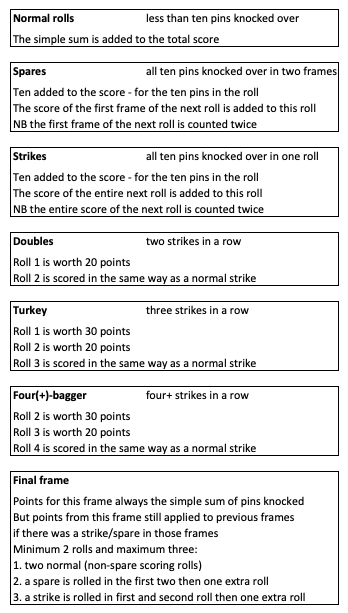

Bowling Challenge in Ruby
=================

This is my solution to [this](https://github.com/makersacademy/bowling-challenge-ruby) challenge

## Scoring in Bowling

Bowling consists of ten frames (AKA turns) in which (usually) two rolls are made to try and knock over pins.  
Scoring is not a matter of just adding up the knocked over pins.  
There are special rules to consider when:  
- A spare is rolled (all ten pins in two rolls)  
- A strike is rolled (all ten pins in one roll)  
- A double is rolled (two strikes in a row)  
- A turkey is rolled (three strikes in a row)  
- A four-bagger is rolled (four strikes in a row) - also five-bagger, six-bagger and so on
- In the final frame  

### Scoring breakdown



### Example game


## Instructions for use

Open a terminal and navigate to a directory in which this can be saved, then follow the below to run the program.  

```
$ git clone https://github.com/AdamusBG/bowling-challenge-ruby.git
$ ruby bowling-challenge-ruby/run.rb
```
