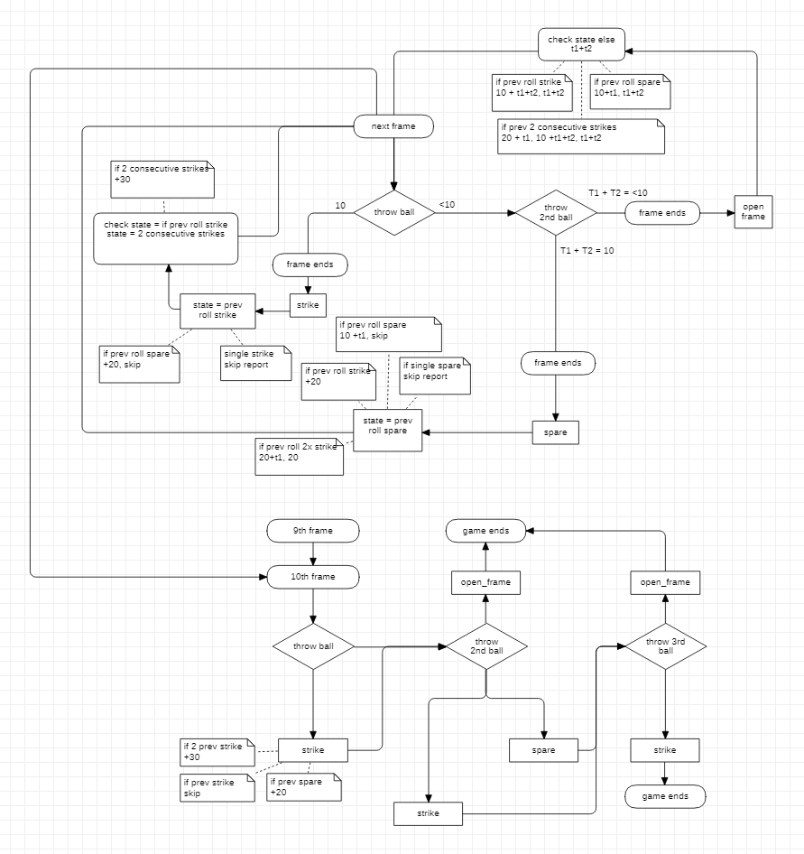

# Bowling Scorecard 

## Thought process...

So originally I thought it couldn't be that hard to make a bowling scorecard...

Then after that I deleted everything and made a flow diagram of how a bowling game is structured which allowed me to ensure I covered all the bases.

## Demo the logic

1. clone
2. `bundle install`
3. run `irb`
4. `require './lib/run.rb'`
5. type `run`
6. input your desired bowling responses

Easiest to test is strikes all the way so just `10` `enter` `enter` 

