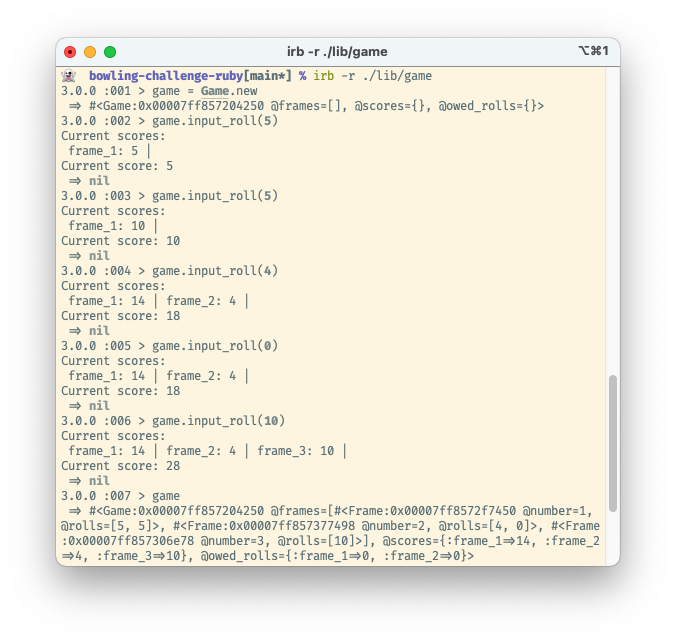

## Bowling Scorecard Challenge in Ruby

This is a ten-pin bowling score calculator. It's focussed on the logic of the scoring rather than useability. There's no UI but it does print out the current scorecard and total score after each entered roll.


### The Task
Ten-pin bowling has surprisingly [complex rules](https://en.wikipedia.org/wiki/Ten-pin_bowling#Scoring). Essentially the score is the number of pins knocked over per round (frame), but there are bonus points if all ten pins fall after only one or two consecutive rolls.

This was the 5th weekend challenge for [Makers Academy](https://makers.tech). The goal was to practise some more test-driven (TDD) Ruby.

It looks like this:


### Installation
* Install Ruby. This code was written in Ruby 3.0.0.
* Clone this repo and navigate into it
* No gems are necessary to interact with the code manually
* Run `irb -r ./lib/game` to load the files into the irb REPL

#### Run the test suite:
* Make sure Bundler is installed
* Run `bundle` to install RSpec
* Run `rspec` to run the (fully isolated) unit tests


### Technical Approach
Objects of the Frame class store their roll values, and know whether the frame has been completed or not. Since the bonus points from good rolls depend on adding future rolls to the frame's score, I also added a method called `owed_rolls` to track if any bonus rolls were due to be added.

The Game class creates a new Frame as appropriate and adds it to an array. It also has two hashes for frame score sums and managing the owed rolls. For neatness, I added the hash keys dynamically on Frame creation, using string interpolation based on the length of the Frames array.  
```ruby
frames = ["one Frame"]
scores = Hash.new
scores["frame_#{frames.length}".to_sym] = 0
>> {:frame_1=>0}
```


### Known Problems
* There is no error checking for invalid roll input - the user can enter any number currently.
* The Game class is in charge of printing out and summing scores, as well as inputting new rolls. It might be better to refactor the roll inputs separately into a Roll class.
* Magic numbers present.
