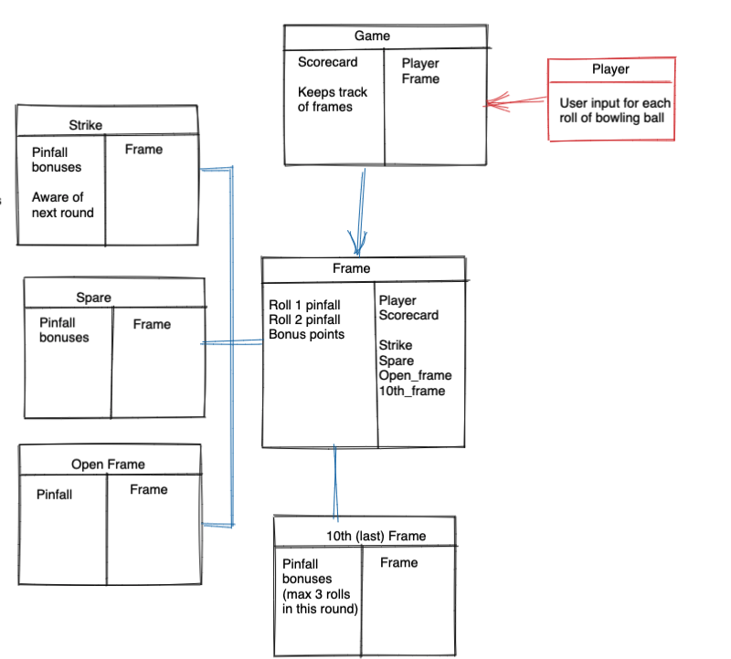

Bowling Challenge in Ruby
=================
## The Task
Count and sum the scores of a bowling game for one player.

## How to use:
-------
* Clone this repo.
* Run the command 'bundle' in the project directory to ensure you have all the gems.
* Run tests with RSpec.
* Run tests with Rubocop.
* Run with irb in terminal, `require './lib/frame'` to test some frames by inputting the scores. For example `frame.first_roll(4)` ...

## Process

=================

=================

### Frame class - IRB tests:

Strike
- 001 > require './lib/frame'
- => true 
- :002 > frame = Frame.new
- => #<Frame:0x00007f874d0bf820> 
- :003 > frame.first_roll(4)
- => "Player to roll again" 
- :004 > frame.first_roll(10)
- => "STRIKE! End of frame" 

Spare
- 3.0.0 :002 > frame = Frame.new
-  => #<Frame:0x00007fd6dfa121c0 @pinfall={:roll1=>nil, :roll2=>nil}, @scorecard=[], @bonus=nil> 
- 3.0.0 :003 > frame.first_roll(4)
-  => "Player to roll again" 
- 3.0.0 :004 > frame.second_roll(6)
-  => "SPARE!" 
- 3.0.0 :005 > frame.first_roll(4)
-  => "Player to roll again" 
- 3.0.0 :006 > frame.second_roll(6)
-  => "SPARE!" 
- 3.0.0 :007 > frame.scorecard
-  => [{:roll1=>4, :roll2=>6, :bonus_points=>4}, {:roll1=>4, :roll2=>6}] 
- 3.0.0 :008 > 

Work in progress
- I have written a test to start looking at playing a full game of bowling and printing a scoresheet. I have started writing a test, but I need to think more about how I want to display the info. When I have more time I will pick it up from here.

## The Task

**THIS IS NOT A BOWLING GAME, IT IS A BOWLING SCORECARD PROGRAM. DO NOT GENERATE RANDOM ROLLS. THE USER INPUTS THE ROLLS.**

Count and sum the scores of a bowling game for one player. For this challenge, you do _not_ need to build a web app with a UI, instead, just focus on the logic for bowling (you also don't need a database). Next end-of-unit challenge, you will have the chance to translate the logic to Javascript and build a user interface.

A bowling game consists of 10 frames in which the player tries to knock down the 10 pins. In every frame the player can roll one or two times. The actual number depends on strikes and spares. The score of a frame is the number of knocked down pins plus bonuses for strikes and spares. After every frame the 10 pins are reset.

As usual please start by

* Forking this repo

* Finally submit a pull request before Monday week at 9am with your solution or partial solution.  However much or little amount of code you wrote please please please submit a pull request before Monday week at 9am. 

___STRONG HINT, IGNORE AT YOUR PERIL:___ Bowling is a deceptively complex game. Careful thought and thorough diagramming — both before and throughout — will save you literal hours of your life.

## Focus for this challenge
The focus for this challenge is to write high-quality code.

In order to do this, you may pay particular attention to the following:
* Using diagramming to plan your approach to the challenge
* TDD your code
* Focus on testing behaviour rather than state
* Commit often, with good commit messages
* Single Responsibility Principle and encapsulation
* Clear and readable code

## Bowling — how does it work?

### Strikes

The player has a strike if he knocks down all 10 pins with the first roll in a frame. The frame ends immediately (since there are no pins left for a second roll). The bonus for that frame is the number of pins knocked down by the next two rolls. That would be the next frame, unless the player rolls another strike.

### Spares

The player has a spare if the knocks down all 10 pins with the two rolls of a frame. The bonus for that frame is the number of pins knocked down by the next roll (first roll of next frame).

### 10th frame

If the player rolls a strike or spare in the 10th frame they can roll the additional balls for the bonus. But they can never roll more than 3 balls in the 10th frame. The additional rolls only count for the bonus not for the regular frame count.

    10, 10, 10 in the 10th frame gives 30 points (10 points for the regular first strike and 20 points for the bonus).
    1, 9, 10 in the 10th frame gives 20 points (10 points for the regular spare and 10 points for the bonus).

### Gutter Game

A Gutter Game is when the player never hits a pin (20 zero scores).

### Perfect Game

A Perfect Game is when the player rolls 12 strikes (10 regular strikes and 2 strikes for the bonus in the 10th frame). The Perfect Game scores 300 points.

In the image below you can find some score examples.

More about ten pin bowling here: http://en.wikipedia.org/wiki/Ten-pin_bowling

