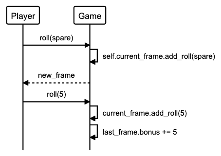

Bowling Challenge in Ruby 🎳
==========================

[](https://travis-ci.com/AJ8GH/bowling-challenge-ruby) [](https://coveralls.io/github/AJ8GH/bowling-challenge-ruby?branch=main) [](https://github.com/rubocop/rubocop) [](https://codeclimate.com/github/AJ8GH/bowling-challenge-ruby/maintainability)

Bowling score tracker written in Ruby

## Specification

- Create a program to calculate bowling scores for a single game
- Program should implement the logic, but not a UI
- Methods and classes should be short and clean, with clear responsibilites

## Approch and design

Classes:

Game
  - the interface where rolls are input into the system
  - manages frames and applies spare and strike bonuses.

Frame
  - stores rolls and knows if they are spares or strikes, and when they are over.
  - Once it knows it is a final frame, it's logic handles the various scenarios (whether the player gets 2 or 3 roles).

ScoreBoard
  - calculates overall score of the game or running total as you normally get on a bowling scorecard.
  - the program auto-calculates the score after each frame and the bonuses after each roll, and advances the game as the user inputs their rolls:

```shell
# irb
2.7.2 :001 > g = Game.new
 => #<Game:0x00007fc536d33030 @frame_class=Frame, @score_board=ScoreBoard, @current_frame=#<Frame:0x00007fc53...
2.7.2 :002 > g.add_roll(5)
 => 0
2.7.2 :003 > g.add_roll(4)
 => 9
2.7.2 :004 > g.add_roll(9)
 => 9
2.7.2 :005 > g.add_roll(1)
 => 19
2.7.2 :006 > g.add_roll(1)
 => 20
```

- The scoring system works identically to official bowling rules. Spare and strike bonuses are automatically added after the relevant roll has been taken:

```shell
2.7.2 :002 > g.add_roll(10)
 => 10
2.7.2 :003 > g.add_roll(6)
 => 16
2.7.2 :004 > g.add_roll(4)
 => 30
2.7.2 :005 > g.add_roll(7)
 => 37
2.7.2 :006 > g.add_roll(2)
 => 46
 ```

- ScoreBoard output for perfect game - total score:

```shell
2.7.2 :001 > g = Game.new
 => #<Game:0x00007f91e04c8c08 @frame_class=Frame, @score_board=ScoreBoard, @current_frame=#<Frame:0x00007f91e...
2.7.2 :002 > 12.times { g.add_roll(10) }
 => 12
2.7.2 :003 > g.score
 => 300
```
- And running total:

```shell
2.7.2 :004 > g.score_board.running_total
 => [30, 60, 90, 120, 150, 180, 210, 240, 270, 300]
```

- Game class uses dependency injection within an argument hash. This reduces dependency on the classes being passed in allowing them to be replaced with doubles in the isolated unit tests. The hash further reduces any dependency on the order the arguments are passed in.

```ruby
  def initialize(args = {})
    @frame_class = args[:frame_class] || Frame
    @score_board = args[:score_board] || ScoreBoard
    @current_frame = frame_class.new
    @frames = []
  end
```

- Thorough testing:
  - 100% test coverage
  - unit tests are isolated and test each piece of individual logic, applying doubles and stubs where needed
  - feature tests run the entire game through, asserting that the flow of the frames and the scoring is correct
  - edge cases such as perfect games and gutter games are thoroughly tested
  - Tests are designed to focus on behaviour rather than state

- OOD:
  - methods have been designed to be as simple and readable as possible
  - SRP: code is designed to follow single responsibility as much as possible, without impacting the readability and logical flow for the reader
  - Open / Closed principle: by choosing to inject my classes as hash argurments, the program is open for extension and closed for modification. Scoreboard can also be extended with additional score outputs if necessary

Agile and BDD:
  - sequence diagrams and class models I used are further down in this readme

## Dependencies

Ruby version:
- `2.7.2`

Gems
-  `coveralls`
-  `reek`
-  `rspec`
-  `rspec-core`
-  `rubocop`
-  `simplecov`
-  `simplecov-console`

# Getting started

Clone this repositiory and install the dependencies

```shell
git clone git@github.com:AJ8GH/bowling-challenge-ruby.git
cd bowling-challenge-ruby
bundle
```

## Running tests

Use rspec to run tests:

```shell
rspec
```

Use the `-fd` flag to see format documentation output of tests:

```shell
rspec -fd
```

## Reflections

- Bowling is a deceptively complex game and ensuring short methods and classes which wouldn't generate code-smells took careful planning, thought and diagramming
- Doing this challenge again, I would likely approach it in a very similar way, particuarly the logic. However I would possibly consider using one or maybe 2 additional classes.

## User stories

```
As a bowler,
So that I can track my score while I play,
I want to be able to record a score from 1 roll.

As a bowler,
So that I can accurately assess my game,
I want to be able to record the score of individual roles,

As a bowler,
So that I can track my total score across multiple rolls and frames,
I want my score to accumlate as I play.

Specs:
- 10 frames
- spare bonuses
- strike bonuses
- final frame bonus rolls
```

## Models

### Class models

objects | Messages
--------|----------
Game    | game.roll
Game    | game.score -> sum of 2 rolls or 1 roll if strike
Game    | game.over
Game    | game.final_frame?
Game    | game.bonus
Frame   | frame.over?
Frame   | frame.status -> :strike, :spare
Frame   | frame.score -> sum of 2 rolls or 1 roll if strike

### sequence diagrams

Standard frame:


Spare bonus:



Strike bonus


2 strike final frame


Final frame spare


2 roll final frame


----

## Rules

### basic functionality
- 1 player
- 10 frames
- rolls per regular frame:
  - 1 if strike
  - 2 if *no* strike
- rolls per final frame:
  - 2 if *no* spare or strike
  - 3 if spare or strike
- score = number of pins *(+ strike / spare bonus)*

### bonuses
- ***strike bonus:***
  - number of pins knocked down in next 2 rolls
- ***spare bonus:***
  - number of pins knocked down in next roll
- ***final frame bonus***
  - spare or strike in final frame results in 3 rolls total for that frame
  - spare: 1 extra roll
  - strike: 2 extra rolls

### Special games
- ***perfect game:***
  - 12 strikes (10 + 2 bonus rolls)
  - 300 points
- ***gutter game:***
  - 20 zero rolls
  - 0 points

### Edge cases
- player can't input values equalling > 10 over 2 rolls of a frame
- perfect game:
  - final 3 frames scoring table:

total score | frame | frame roll | frame bonus | frame score
------------|-------|------------|-------------|-------------
240         | 8     | 10         | 20          | 30
270         | 9     | 10         | 20          | 30
300         | 10    | 10 * 3     | n/a         | 30
