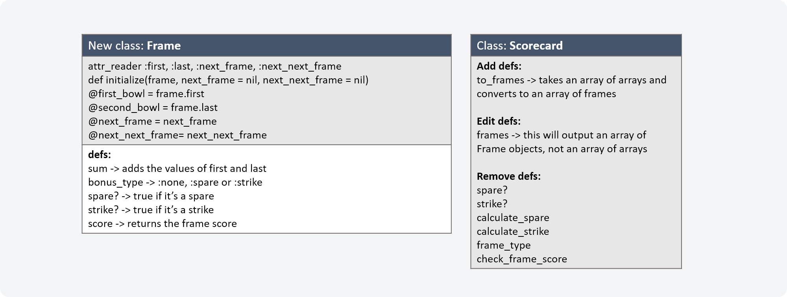

Introduction
---------
This repo contains the code I wrote for the Bowling Challenge, the Makers Academy Week 5 end-of-week challenge. This involved writing code for a bowling scorecard that could count and sum scores for a game of bowling.

The main focus of this challenge was writing high-quality code, with an emphasis on planning, test-driven development, behaviour testing, good commit messaging, encapsulation, the Single Responsibility Principle (SRP), and clear, readable code.

My approach
---------
### Planning
I began by planning out the logical steps I felt would be necessary to calculate the final score of a bowling game based on an input array of pins knocked down with individual bowls:
```
1. Convert rolls into an array of frames (frame = a pair of bowls, e.g. [2, 3])
2. Convert values 0 - 9 to their frame scores:
    a) If the frame values don't add to 10, convert the frame to their sum
    b) If the frame values do add up to 10 but don't contain a 10, convert to frame sum + first value in next frame
    c) If the frame values contain a 10 AND the next frame doesn't, convert to 10 + next frame sum
    d) If the frame values contain a 10 AND so does the next frame, convert to 10 + 10 + first value in nextx2 frame
3. Convert values 10 and up to 0
4. Sum all values
```
I then added a fifth step that would allow an accumulating score to be recorded at the end of each frame:
```
5. Count bowls at the end of every new scored_bowl added
```
Once that was done, I wrote some very basic code that replicated the logic of my plan:
```
bowls = [1, 4, 4, 5, 6, 4, 5, 5, 10, 0, 1, 7, 3, 6, 4, 10, 2, 8, 6]
# bowls = [10,10,10,10,10,10,10,10,10,10,10,10]
# bowls = [0,0,0,0,0,0,0,0,0,0,0,0,0,0,0,0,0,0,0,0]

# 1. Convert rolls into frames
framed_bowls = []
i = 0
puts bowls.length
while i < bowls.length
  frame = []
  frame << bowls[i]
  if bowls[i] < 10
    i += 1
    frame << bowls[i] unless bowls[i].nil?
  end
  framed_bowls << frame
  i += 1
end
puts print framed_bowls
# 2. Convert values 0 - 9 to their frame scores:
#    a) If the frame values don't add to 10, convert the frame to their sum
#    b) If the frame values do add up to 10 but don't contain a 10, convert to frame sum + first value in next frame
#    c) If the frame values contain a 10 AND the next frame doesn't, convert to 10 + next frame sum
#    d) If the frame values contain a 10 AND so does the next frame, convert to 10 + 10 + first value in nextx2 frame
# 3. Convert values 10 and up to 0
# 4. Sum all values
# 5. Count bowls at the end of every new scored_bowl added
scored_bowls = []
count_bowls = []
j = 0
while j <= framed_bowls.length
  if j > 9
    scored_bowls << 0
  else
    scored_bowls << if framed_bowls[j].sum < 10
                      framed_bowls[j].sum
                    elsif framed_bowls[j].include? 10
                      if framed_bowls[j + 1].include? 10
                        20 + framed_bowls[j + 2].first
                      else
                        10 + framed_bowls[j + 1].sum
                      end
                    else
                      (framed_bowls[j].sum + framed_bowls[j + 1].first)
                    end
    count_bowls << scored_bowls.sum
  end
  j += 1
end
puts print scored_bowls
puts print count_bowls
puts scored_bowls.sum
```
I used the Code Runner extension for VS Code to run multiple tests with various inputs to check if the logic produced the results I wanted. Once I had confirmed the logic of my plan made sense, I proceeded to producing class-based code.

### Scorecard class
Initially, I felt a single class would be sufficient to hold all the necessary information. I decided to create a Scorecard class using a test-driven development approach. Throughout the process, I refactored to ensure adherence to the SRP. I named methods in ways I felt would make the code easy to understand, and added comments to explain more complicated sections.

By the end of this process, I had created a single Scorecard class with all the capabilities necessary to pass the week's challenge.

### Frame class
On reviewing my code, I decided it would make sense to extract a Frame class that could store information about individual frames. Recognising this could be a complicated process, I decided to plan out how I would structure this new class and what changes it would require to my existing one:



I approached the creation of this class in the same way I made the previous one.

Once both classes were fully functional, I isolated the tests for the Frame and Scorecard classes. Then, once all rspec tests were passing, I tested in irb and found a bug which I then fixed. Finally, I refactored both classes and their rspec tests, and I re-wrote some tests to ensure behaviour was being tested rather than state.

Total rspec testing coverage: 100%; tests isolated; rubocop passed with no offences.

Technologies used
---------
The following technologies were used in this repo
1) VS Code was used for all coding requirements
2) Planning diagrams were made in Microsoft Powerpoint
3) Rubocop was used to improve coding readability
4) irb used for testing


Instructions for use
---------
### Setup:
- Clone this repo to a local repository
- Open irb and enter: 'require "./lib/scorecard.rb"'

### Interaction:
- In irb, create a new iteration of the scorecard class, e.g. 'my_card = Scorecard.new'. This will initiate with a default list of individual bowl scores
- Use the .score method to view the final score
- Use the .accumulative_scores method to view how the individual bowl scores accumulated over the course of the game to reach the final score
- You can also specify your own individual bowl scores by specifying an array of values as an argument on the .new call. For example, a perfect game involved throwing 12 strikes (strike value = 10). Entering 'perfect_game = Scorecard.new([10]*12)' will create a scorecard for a perfect game. Entering 'perfect_game.score' will then return a final score of 300.
