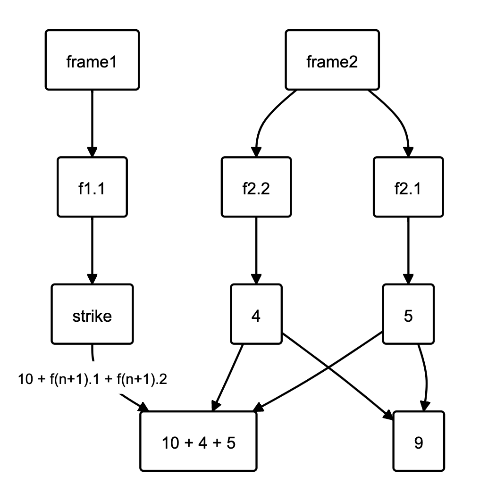

Bowling Challenge in Ruby
=================

I did some planning and some flow diagrams to work out how (and when) spares and strikes were scored, and tried to use an input and output table to help my process. I don't think I did this very successfully.

INPUT | OUTPUT
-|-
1,2 | 3
4,6 | 10 + enter next roll
5,3 | updates result above + 5, and scores 8 here
10 | 10 + enter next roll
5,3 | updates result above + 5 + 3, and scores 8 here
10 | 10 + enter next roll
10 | updates result above + 10 + enter next roll
5,3 | updates 2 above with + 5, the result above with + 5 + 3, and scores 8 here

The first thing I did was write code that calculated the scores given a full set of scores. This was a way for me to get my head around the maths. Once I had achieved this, I moved on to making it more interactive - ie updating as it went along. I struggled with this a lot more! Even with attempts at diagramming and tables, I have spent hours on it :(

After trying to decide what classes to do and getting a bit frustrated, I did a bit of research into coding a bowling scorecard to see if anyone had any suggestions. I looked at a couple of different sites which briefly talked about it (in different computing languages) and decided on a Bowling class and a Scorer class. The bowling class is responsible for counting the frames and managing the gameplay, the Scorer class is responsible for the actual scoring - calculating frame totals, bonuses and the final total score.

I initially had some very busy methods but managed to refactor them to make them smaller.

I'm pleased with my TDD and most of my refactoring. I'm sure there is a way to do it better! eg. I wonder if there is a way to get the Scorer's #calculate method smaller by using some sort of hash of the rules?

Improvements: I must commit more!!!! I usually like to try to experiment before committing, but perhaps I could do this on different branches?

Makers Readme:
===================
* Feel free to use google, your notes, books, etc. but work on your own
* If you refer to the solution of another coach or student, please put a link to that in your README
* If you have a partial solution, **still check in a partial solution**
* You must submit a pull request to this repo with your code by 9am Monday week

## The Task

**THIS IS NOT A BOWLING GAME, IT IS A BOWLING SCORECARD PROGRAM. DO NOT GENERATE RANDOM ROLLS. THE USER INPUTS THE ROLLS.**

Count and sum the scores of a bowling game for one player. For this challenge, you do _not_ need to build a web app with a UI, instead, just focus on the logic for bowling (you also don't need a database). Next end-of-unit challenge, you will have the chance to translate the logic to Javascript and build a user interface.

A bowling game consists of 10 frames in which the player tries to knock down the 10 pins. In every frame the player can roll one or two times. The actual number depends on strikes and spares. The score of a frame is the number of knocked down pins plus bonuses for strikes and spares. After every frame the 10 pins are reset.

As usual please start by

* Forking this repo

* Finally submit a pull request before Monday week at 9am with your solution or partial solution.  However much or little amount of code you wrote please please please submit a pull request before Monday week at 9am. 

___STRONG HINT, IGNORE AT YOUR PERIL:___ Bowling is a deceptively complex game. Careful thought and thorough diagramming — both before and throughout — will save you literal hours of your life.

## Focus for this challenge
The focus for this challenge is to write high-quality code.

In order to do this, you may pay particular attention to the following:
* Using diagramming to plan your approach to the challenge
* TDD your code
* Focus on testing behaviour rather than state
* Commit often, with good commit messages
* Single Responsibility Principle and encapsulation
* Clear and readable code

## Bowling — how does it work?

### Strikes

The player has a strike if he knocks down all 10 pins with the first roll in a frame. The frame ends immediately (since there are no pins left for a second roll). The bonus for that frame is the number of pins knocked down by the next two rolls. That would be the next frame, unless the player rolls another strike.

### Spares

The player has a spare if the knocks down all 10 pins with the two rolls of a frame. The bonus for that frame is the number of pins knocked down by the next roll (first roll of next frame).

### 10th frame

If the player rolls a strike or spare in the 10th frame they can roll the additional balls for the bonus. But they can never roll more than 3 balls in the 10th frame. The additional rolls only count for the bonus not for the regular frame count.

    10, 10, 10 in the 10th frame gives 30 points (10 points for the regular first strike and 20 points for the bonus).
    1, 9, 10 in the 10th frame gives 20 points (10 points for the regular spare and 10 points for the bonus).

### Gutter Game

A Gutter Game is when the player never hits a pin (20 zero scores).

### Perfect Game

A Perfect Game is when the player rolls 12 strikes (10 regular strikes and 2 strikes for the bonus in the 10th frame). The Perfect Game scores 300 points.

In the image below you can find some score examples.

More about ten pin bowling here: http://en.wikipedia.org/wiki/Ten-pin_bowling

