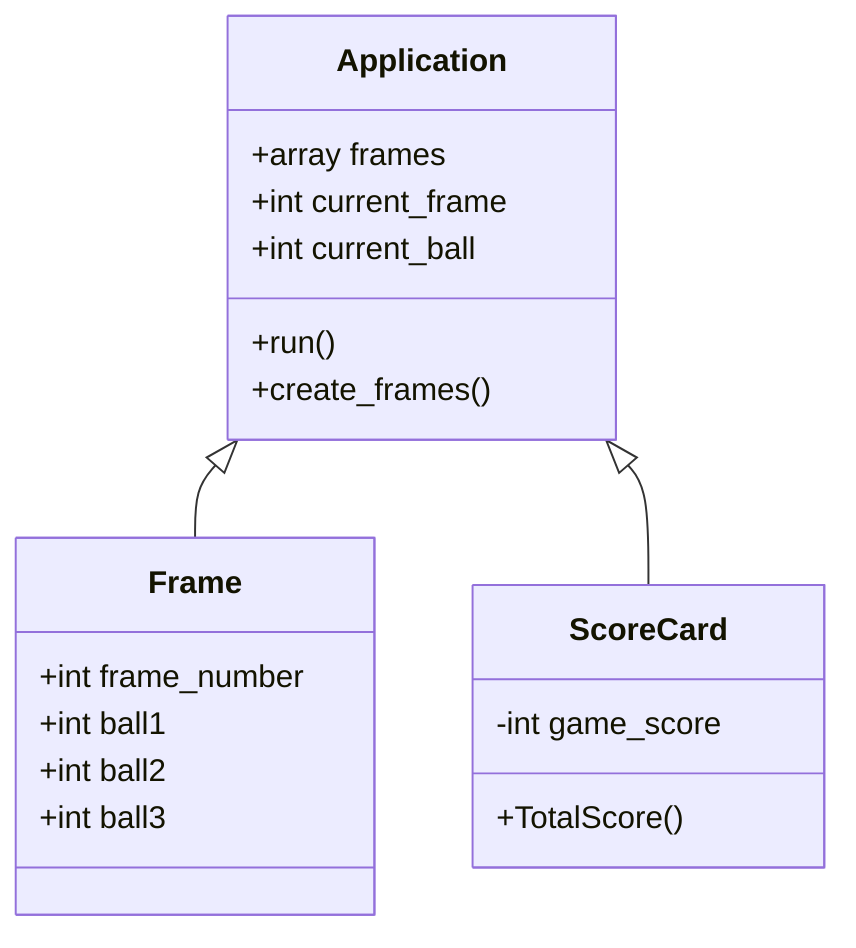

# Bowling Challenge Multi-Class Planned Design Recipe

## 1. Describe the Problem

Count and sum the scores of a bowling game for one player.

### Bowling scoring

Scoring it bowling is pretty tricky. This is a representation of how the logic works.


## 2. Design the Class System



```ruby
class Application
  def initialize
    @frames = []
    @current_frame = 1
    @current_frame_ball = 1
    create_frames
  end

  def run
    # Runs an IO loop and calls the other classes
  end

  def create_frames
    # Runs once when .run starts to create the `@frames` array of frame objects
  end

  def return_frames
    # Returns the `@frames` array
  end
end

class Frame
  # A model class with attributes:
  # :frame_number, :ball_1, :ball_2, :ball_3
end

class ScoreCard
  def GameScore
  end

  def FrameScore
  end
end
```

## 3. Create Examples as Integration Tests

_Create examples of the classes being used together in different situations and
combinations that reflect the ways in which the system will be used._

```ruby
# # Gets all tracks
# library = MusicLibrary.new
# track_1 = Track.new("Carte Blanche", "Veracocha")
# track_2 = Track.new("Synaesthesia", "The Thrillseekers")
# library.add(track_1)
# library.add(track_2)
# library.all # => [track_1, track_2]
```

## 4. Create Examples as Unit Tests

_Create examples, where appropriate, of the behaviour of each relevant class at
a more granular level of detail._

```ruby
# Creates the `@frames` array of `frame` objects
app = Application.new
app.return_frames.length # => 10
```

_Encode each example as a test. You can add to the above list as you go._

## 5. Implement the Behaviour

_After each test you write, follow the test-driving process of red, green,
refactor to implement the behaviour._