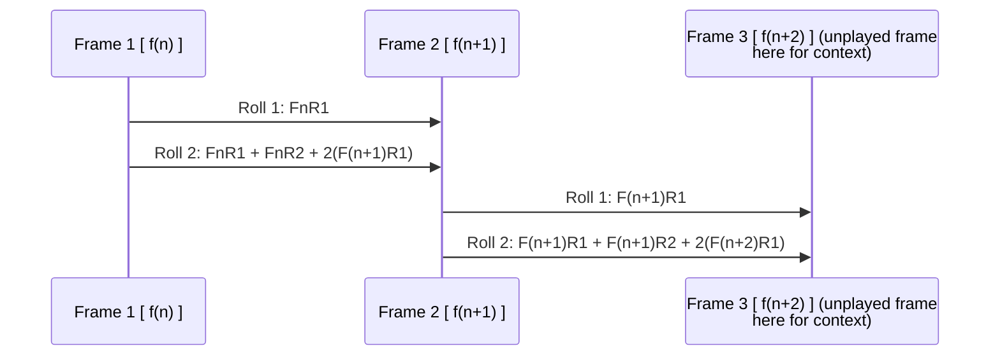
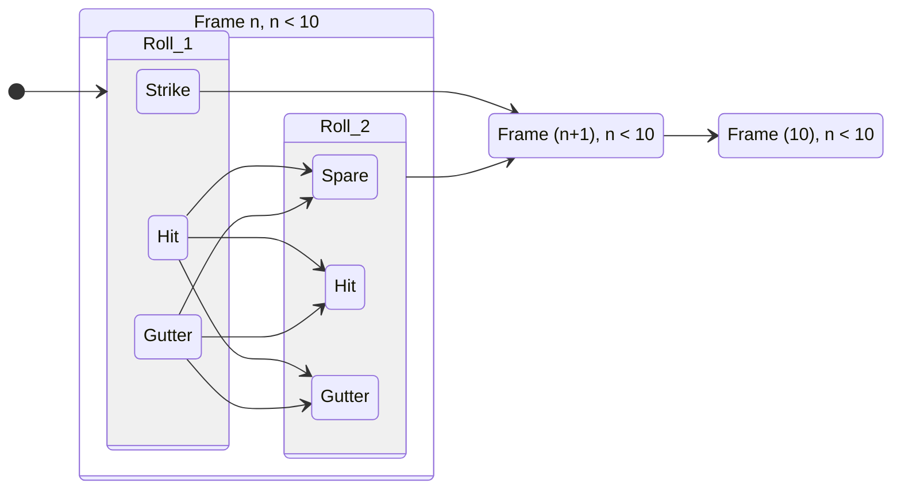

# Spare Frame to Spare Frame
This first conception of a frame got me to understand the way the numbers were working out.
However at this current time I am getting confused in exactly how to implemented this without writiting 
some sort of working code , which wouldnt be TDD. I would really like to understand what is going on here.
Because I know what I am going to do now actually writing code then tests isn't TDD I don't understand the underlying 
theme of what is going on.

## State diagram

# strike Frame to Spare Frame
